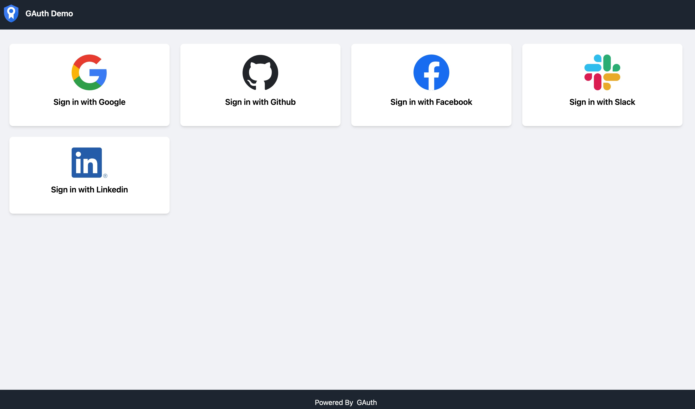

# GAuth Demo

## Introduction

Demo for [GAuth](https://github.com/leoInnovateLab/gauth)

## How to use

Modify the content of the `.env.demo` file, replace the ClientId and ClientSecret with your own.

```shell
make run
``` 
or 
```shell
go run .
```

